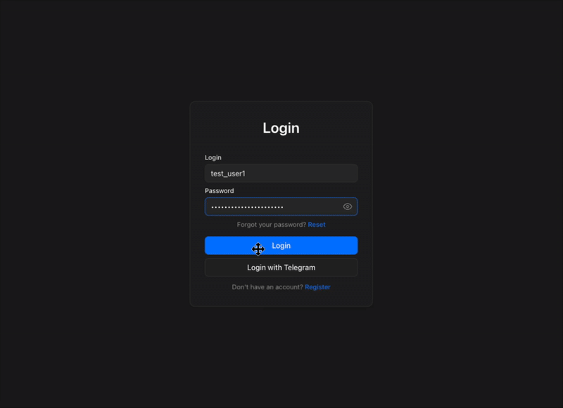

<div align="center">
  
  
  # Fast Ray Gram
</div>

[](https://github.com/axindri/FastRayGram/stargazers)
[](https://github.com/axindri/FastRayGram/network)
[](https://github.com/axindri/FastRayGram/watchers)
[](https://github.com/axindri/FastRayGram)
[](https://github.com/axindri/FastRayGram)
[](https://github.com/axindri/FastRayGram)
[](https://github.com/axindri/FastRayGram)
[](https://github.com/axindri/FastRayGram/blob/main/LICENSE)
[](https://github.com/axindri/FastRayGram/commits/main)
[](https://github.com/axindri/FastRayGram/issues)
[](https://github.com/axindri/FastRayGram/pulls)

---




## Languages / Языки

- [🇬🇧 English](#english) | [🇷🇺 Русский](#русский)

---

## 🇬🇧 English

### About

**Free and Accessible**

🆓 This application is completely **free** and does not aim to make money. Our goal is to make secure internet access more accessible to everyone.

**Open Source**

🔓 The application code is **open source** and available for public review. We do not use users' personal information for personal purposes. All responsibility for hosting and operation of the application remains with the hosting provider.

**Modern Encryption**

🔐 The service provides various configurations using modern traffic encryption protocols. Within the established period, you can use the connection and renew it upon request and administrator approval.

**Our Mission**

❤️ In today's world, staying connected with each other is not always easy. We want to make it a little more accessible, bringing people closer together through secure and reliable internet access.

### User Documentation

- [User Guide](./docs/eng/userguide.md) - Project deployment and server configuration

### Technical Documentation

- [System Architecture](./docs/eng/technical/architecture.md) - Overview of system architecture and components
- [API Documentation](./docs/eng/technical/api.md) - Description of all API endpoints and methods
- [Authentication and Authorization](./docs/eng/technical/authentication.md) - Authentication system, JWT tokens, sessions
- [Role Model and Access Rights](./docs/eng/technical/roles.md) - User roles and permission distribution
- [Service Interaction](./docs/eng/technical/services.md) - How services interact with each other
- [Data Models](./docs/eng/technical/data-models.md) - Data structure and database models

### 🚀 Quick Start

Get started quickly with these steps:

1. Clone the repository:
   ```bash
   git clone https://github.com/axindri/FastRayGram.git
   cd FastRayGram
   ```

2. Copy the environment file:
   ```bash
   cp .env.example .env
   ```

3. Fill in the required parameters in the `.env` file (see [Required Variables to Fill](./docs/eng/userguide.md#required-variables-to-fill) in the User Guide).

4. Start all services:
   ```bash
   make up
   ```

### Setup and Deployment

⚙️ For detailed setup and deployment instructions, see the [User Guide](./docs/eng/userguide.md).

### For Developers

👨‍💻 Technical documentation is available in the [Technical Documentation](./docs/eng/technical/) section.

---

## 🇷🇺 Русский

### О проекте

**Бесплатно и доступно**

🆓 Это приложение полностью **бесплатное**. Наша цель — не заработок, а сделать безопасный доступ в интернет доступным для каждого.

**Открытый код**

🔓 Код приложения — **открытый**, его может просмотреть любой. Мы не используем личные данные пользователей в своих целях. Весь хостинг и инфраструктура обеспечиваются нашими провайдерами, и ответственность за их работу лежит на них.

**Современное шифрование**

🔐 Сервис использует современные протоколы для шифрования вашего трафика. Доступ предоставляется на определённый срок, который можно продлить по запросу с одобрения администратора.

**Наша миссия**

❤️ В современном мире быть на связи бывает непросто. Наша миссия — помогать людям общаться, предоставляя безопасный и надёжный доступ в интернет.

### Пользовательская документация

- [Руководство пользователя](./docs/ru/userguide.md) - Развертывание проекта и настройка на сервере

### Техническая документация

- [Архитектура системы](./docs/ru/technical/architecture.md) - Обзор архитектуры и компонентов системы
- [API Документация](./docs/ru/technical/api.md) - Описание всех API endpoints и методов
- [Аутентификация и авторизация](./docs/ru/technical/authentication.md) - Система аутентификации, JWT токены, сессии
- [Ролевая модель и права доступа](./docs/ru/technical/roles.md) - Роли пользователей и распределение прав
- [Взаимодействие сервисов](./docs/ru/technical/services.md) - Как сервисы взаимодействуют между собой
- [Модели данных](./docs/ru/technical/data-models.md) - Структура данных и модели базы данных

### 🚀 Быстрый старт

Быстро начать работу можно следующими шагами:

1. Клонируйте репозиторий:
   ```bash
   git clone https://github.com/axindri/FastRayGram.git
   cd FastRayGram
   ```

2. Скопируйте файл окружения:
   ```bash
   cp .env.example .env
   ```

3. Заполните обязательные параметры в файле `.env` (см. [Обязательные переменные для заполнения](./docs/ru/userguide.md#обязательные-переменные-для-заполнения) в Руководстве пользователя).

4. Запустите все сервисы:
   ```bash
   make up
   ```

### Настройка и запуск

⚙️ Для детальной настройки и запуска см. [Руководство пользователя](./docs/ru/userguide.md).

### Для разработчиков

👨‍💻 Техническая документация доступна в разделе [Техническая документация](./docs/ru/technical/).

