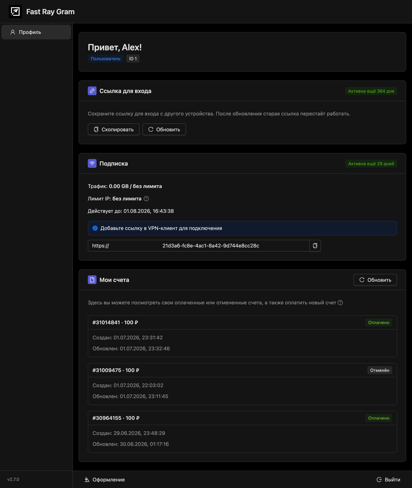
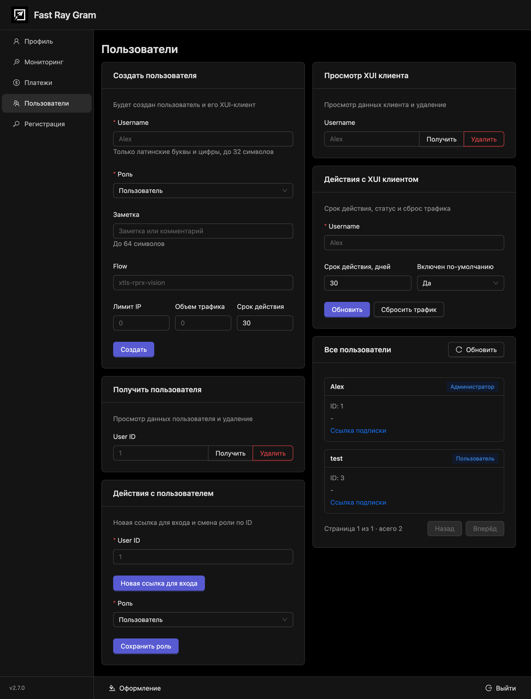
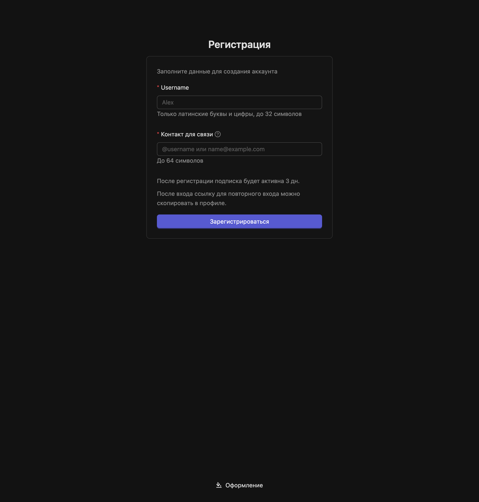
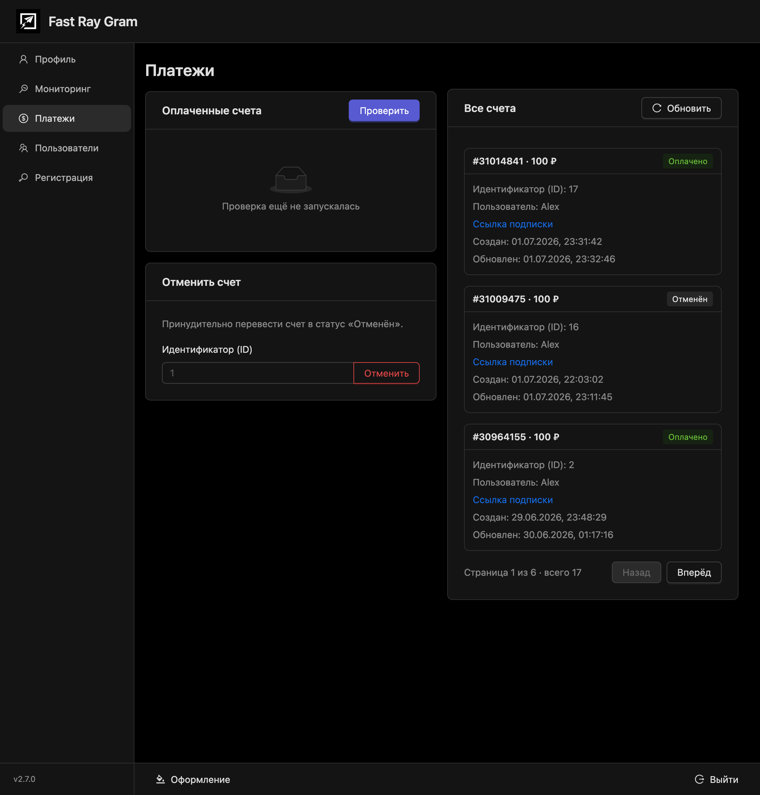

<p align="center">
  
</p>

<h1 align="center">Fast Ray Gram</h1>

<p align="center">
  Личный кабинет и админка для VPN-подписки на базе <strong>3X-UI</strong>
</p>

<p align="center">
  <a href="LICENSE"></a>
  
  
</p>

---

## О проекте

**Fast Ray Gram** — self-hosted веб-приложение для небольших VPN-сервисов:

- **Личный кабинет** — подписка, ссылка для VPN-клиента, оплата продления, вход по ссылке без пароля.
- **Регистрация по коду** — админ выдаёт ссылку, пользователь сам создаёт аккаунт.
- **Админка** — пользователи, XUI-клиенты, счета, коды регистрации, мониторинг сервисов.
- **Платежи** — выставление счетов в TimeWeb, фоновая проверка оплат, продление подписки в XUI.

Стек: **FastAPI** · **SQLite** · **React** · **Ant Design** · **Docker**.

## Скриншоты

Интерфейс в тёмной теме. Все изображения лежат в [`docs/screenshots/`](docs/screenshots/).

| Профиль | Пользователи |
|:---:|:---:|
| [](docs/screenshots/profile.png) | [](docs/screenshots/users.png) |
| Личный кабинет: подписка, ссылка для входа, счета | Админка: создание пользователей и XUI-клиентов |

| Регистрация | Платежи |
|:---:|:---:|
| [](docs/screenshots/register.png) | [](docs/screenshots/payments.png) |
| Самостоятельная регистрация по ссылке от админа | Проверка оплат, список инвойсов, отмена счетов |


## Запуск на сервере

### Пререквизиты

На сервере (VPS / bare metal):

1. **Docker** и **Docker Compose** v2
2. Рабочая панель **3X-UI** (API URL, sub URL, API key)
3. Аккаунт **TimeWeb** с API-токеном и `payer_id` (для приёма платежей)
4. Открытый порт **80/443** (или проброс на `APP_PORT`)

Опционально: reverse proxy (Caddy / Nginx) и TLS-сертификат перед контейнером.

### Деплой

```bash
git clone <repository-url>
cd fast-ray-gram
cp .env.example .env
```

Заполните `.env` — обязательно смените секреты и укажите XUI / TimeWeb.

```bash
docker compose up -d --build
```

Приложение: `http://<ваш-сервер>:8000` (порт задаётся `APP_PORT`).

Вместе с приложением поднимается **invoice-worker** — периодически проверяет оплаченные счета (`CHECK_INTERVAL_SEC`, по умолчанию 30 с).

### Переменные окружения

| Переменная | Описание |
|---|---|
| `APP__JWT_SECRET` | Секрет подписи JWT |
| `APP__SUPERUSER_TOKEN` | Токен суперпользователя и воркера инвойсов |
| `APP__MONITORING_SERVICE_URL` | URL внешнего мониторинга (Uptime Kuma и т.п.) |
| `XUI__URL` / `XUI__SUB_URL` / `XUI__API_KEY` | Панель 3X-UI |
| `TIMEWEB__TOKEN` / `TIMEWEB__PAYER_ID` | Платежи TimeWeb |
| `APP_PORT` | Порт на хосте (по умолчанию `8000`) |
| `CHECK_INTERVAL_SEC` | Интервал проверки оплат |

Полный список — в [`.env.example`](.env.example).

## Документация

- [Участие в разработке и локальный запуск](CONTRIBUTING.md)

## Лицензия

Проект распространяется под лицензией **[GNU General Public License v3.0](LICENSE)**.

Вы можете свободно использовать, изменять и распространять код при условии сохранения той же лицензии для производных работ.
